Lecture 1 Worksheet
================

In this worksheet, we'll be exploring various plot types (i.e., geometric objects), only using the `x` and `y` aesthetics (and `group`).

We'll be jumping straight into the `ggplot()` function, instead of the more limited `qplot()` function.

1.  To get started, load the `tidyverse` and `gapminder` R packages.

``` r
suppressPackageStartupMessages(library(tidyverse))
library(gapminder)
```

Scatterplot
-----------

Let's look at a *scatterplot* of `gdpPercap` vs. `lifeExp`.

1.  Fill out the grammar components below. Again, bold *must* be specified to make a `ggplot2` plot.
    -   We'll ignore "coordinate system" and "facetting" after this.

| Grammar Component     | Specification             |
|-----------------------|---------------------------|
| **data**              | `gapminder`               |
| **aesthetic mapping** | x=lifeExp and y=gdpPercap |
| **geometric object**  | point                     |
| scale                 | linear                    |
| statistical transform | none                      |
| coordinate system     | rectangular/cartesian     |
| facetting             | none                      |

1.  Populate the data and aesthetic mapping in `ggplot`. What is returned? What's missing?

``` r
ggplot(data=gapminder, mapping=aes(x=lifeExp, y=gdpPercap)) +
    geom_point()
```

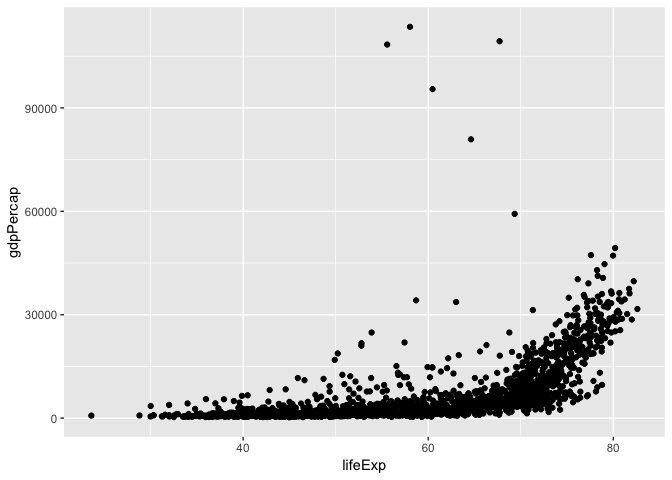

``` r
ggplot(gapminder, aes(lifeExp, gdpPercap)) +
    geom_point()
```


``` r
ggplot(gapminder) +
    geom_point(aes(x=lifeExp, y=gdpPercap))
```


~~3. Add the missing component as a *layer*.~~

Notice the "metaprogramming" again!

1.  You *must* remember to put the aesthetic mappings in the `aes` function! What happens if you forget?

``` r
#ggplot(gapminder) +
#    geom_point(x = lifeExp, y = gdpPercap)
```

1.  Put the x-axis on a log scale, first by transforming the x variable.
    -   Note: `ggplot2` does some data wrangling and computations itself! We don't always have to modify the data frame.

``` r
ggplot(gapminder, aes(lifeExp, gdpPercap)) +
    geom_point() +
    scale_y_log10()
```

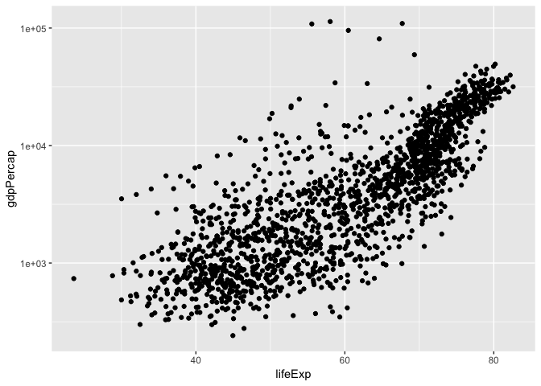

``` r
ggplot(gapminder, aes(lifeExp, log(gdpPercap))) +
    geom_point()
```


~~6. Try again, this time by changing the *scale* (this way is better).~~

~~7. The aesthetic mappings can be specified on the geom layer if you want, instead of the main `ggplot` call. Give it a try:~~

1.  Optional: git stage and commit

**Uses of a scatterplot**:

-   Visualize 2-dimensional distributions; dependence.
-   2 numeric variables

Histograms, and Kernel Density Plots
------------------------------------

Let's build a histogram of life expectancy.

1.  Fill out the grammar components below. Again, bold *must* be specified to make a `ggplot2` plot.

| Grammar Component     | Specification                                  |
|-----------------------|------------------------------------------------|
| **data**              | `gapminder`                                    |
| **aesthetic mapping** | x=lifeExp, y=count (**corrected from before**) |
| **geometric object**  | histogram                                      |
| scale                 | x and y both linear                            |
| statistical transform | count                                          |

1.  Build the histogram of life expectancy.

``` r
ggplot(gapminder, aes(lifeExp)) +
    geom_histogram(bins=50)
```

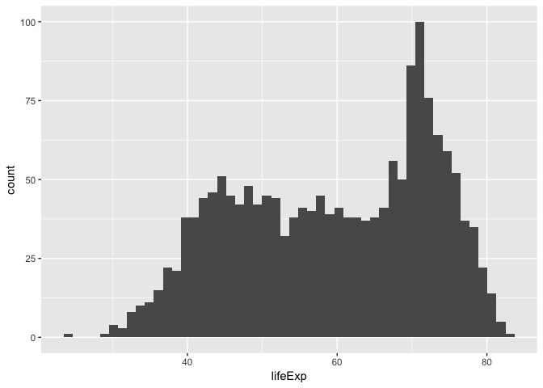

~~3. Change the number of bins to 50.~~

1.  Instead of a histogram, let's create a kernel density plot.

``` r
ggplot(gapminder, aes(lifeExp)) +
    geom_density()
```

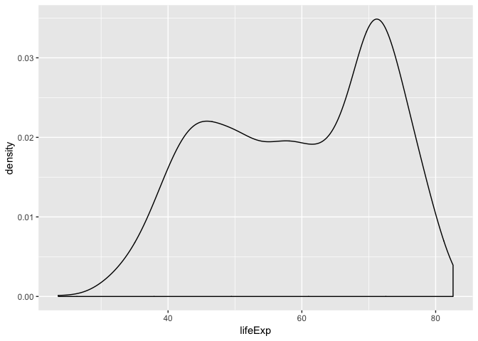

1.  Optional: git stage and commit

**Uses of a histogram**: Explore the distribution of a single numeric variable.

Box plots, and violin plots
---------------------------

Let's make *box plots* of population for each continent. Note: y-axis is much better on a log scale!

1.  Fill out the grammar components below. Again, bold *must* be specified to make a `ggplot2` plot.

<table style="width:56%;">
<colgroup>
<col width="33%" />
<col width="22%" />
</colgroup>
<thead>
<tr class="header">
<th>Grammar Component</th>
<th>Specification</th>
</tr>
</thead>
<tbody>
<tr class="odd">
<td><strong>data</strong></td>
<td><code>gapminder</code></td>
</tr>
<tr class="even">
<td><strong>aesthetic mapping</strong></td>
<td>x=continent, y=gdpPercap</td>
</tr>
<tr class="odd">
<td><strong>geometric object</strong></td>
<td>boxplot OR violin</td>
</tr>
<tr class="even">
<td>scale</td>
<td>log-y; x is linear</td>
</tr>
<tr class="odd">
<td>statistical transform</td>
<td>boxplot: 5 number summary; violinplot: density estimate</td>
</tr>
</tbody>
</table>

1.  Initiate the `ggplot` call, with the log y scale, and store it in the variable `a`. Print out `a`.

``` r
a <- ggplot(gapminder, aes(continent, gdpPercap)) +
    scale_y_log10()
```

1.  Add the boxplot geom to `a`.

``` r
a + geom_boxplot()
```

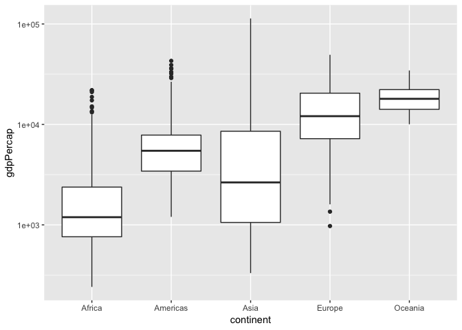

``` r
a + geom_point(alpha=0.2)
```

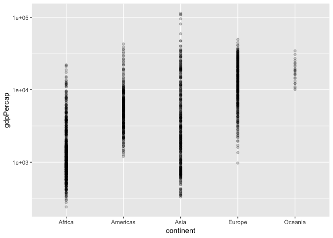

1.  A violin plot is a kernel density on its side, made symmetric. Add that geom to `a`.
    -   What's better here, boxplots or violin plots? Why?

``` r
a + geom_violin()
```

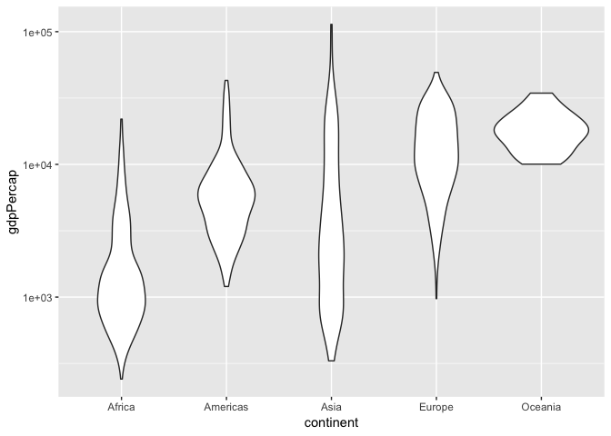

``` r
ggplot(gapminder, aes(continent, lifeExp)) +
    geom_violin()
```

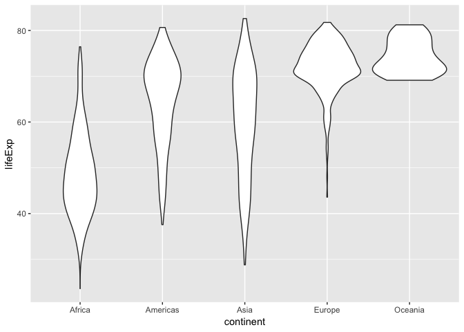

1.  Optional: git stage and commit

**Use of boxplot**: Visualize 1-dimensional distributions (of a single numeric variable).

Jitter plots
------------

Let's work up to the concept of a *jitter plot*. As above, let's explore the population for each continent, but using points (again, with the y-axis on a log scale).

Let's hold off on identifying the grammar.

1.  Initiate the `ggplot` call to make a scatterplot of `continent` vs `pop`; initiate the log y scale. Store the call in the variable `b`.

``` r
b <- ggplot(gapminder, aes(continent, pop)) +
    scale_y_log10()
```

1.  Add the point geom to `b`. Why is this an ineffective plot?

``` r
b + geom_point()
```

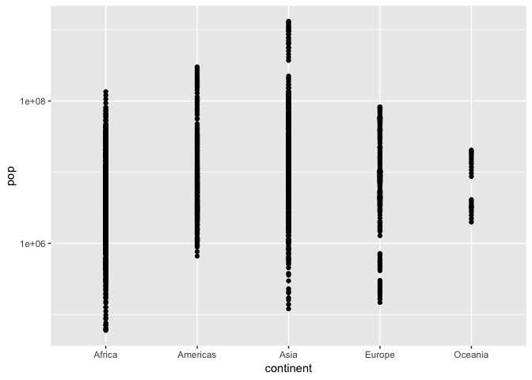

1.  A solution is to jitter the points. Add the jitter geom. Re-run the command a few times -- does the plot change? Why?

``` r
b + geom_jitter()
```

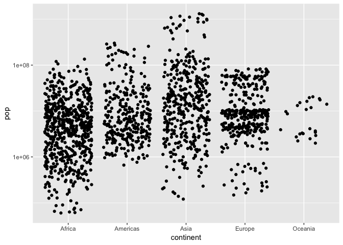

``` r
b + geom_violin() + geom_jitter(alpha=0.1)
```

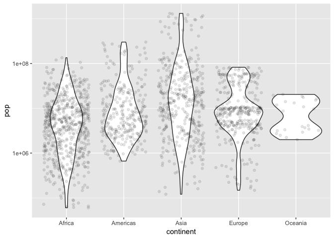

1.  How does the grammar differ from a box plot or violin plot?
    -   ANSWER:
2.  We can add multiple geom *layers* to our plot. Put a jitterplot overtop of the violin plot, starting with our base `b`. Try vice-versa.

3.  Optional: git stage and commit

**Uses of jitterplot**: Visualize 1-dimensional distributions, AND get a sense of the sample size.
