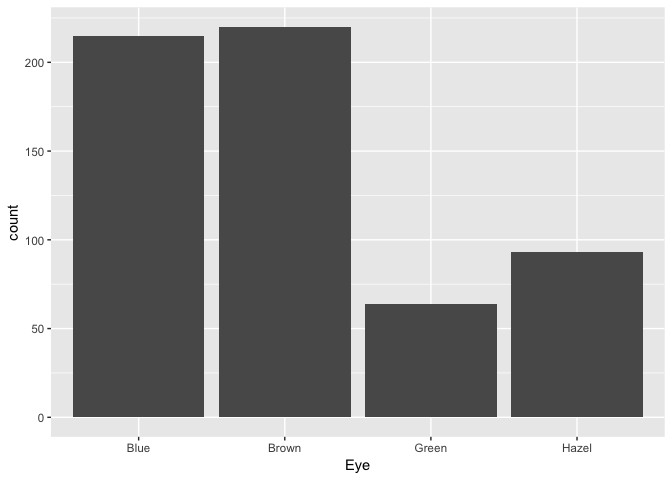
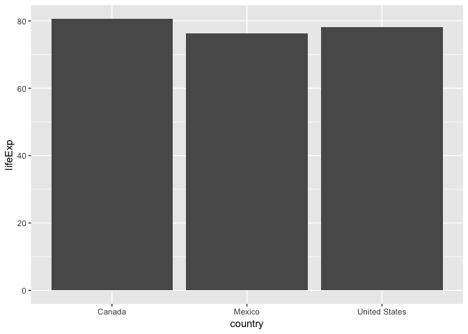
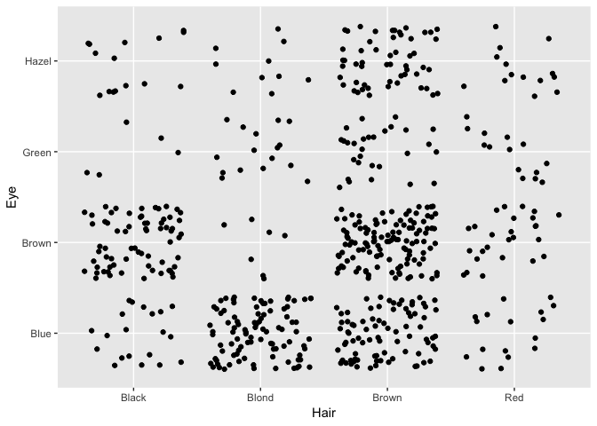
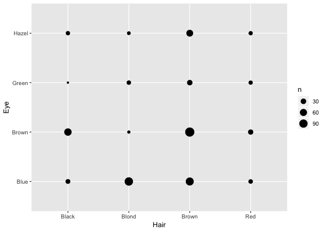
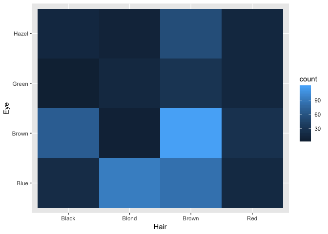
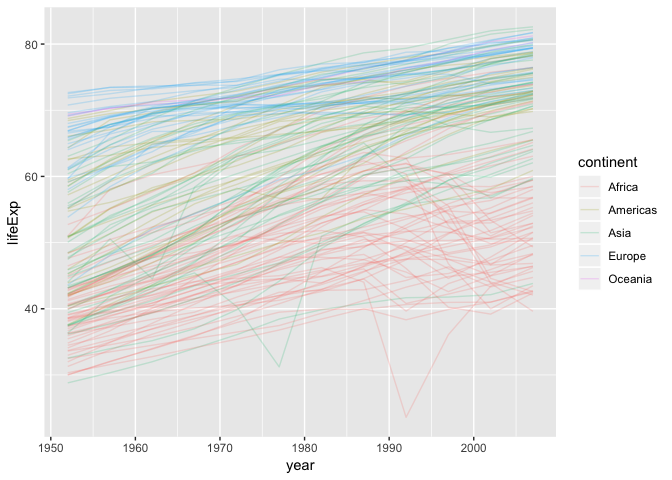
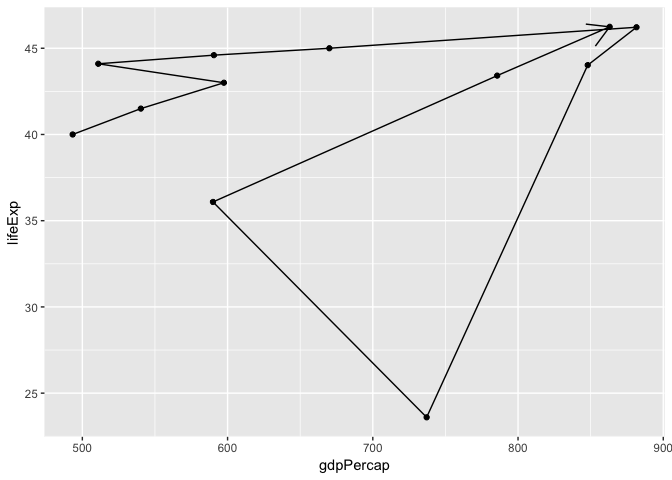

Lecture 2 Worksheet
================

``` r
suppressPackageStartupMessages(library(tidyverse))
library(gapminder)
students <- as_tibble(HairEyeColor) %>% 
    uncount(n)
```

Note: `students` contains 592 observations of Hair, Eye, and Sex:

``` r
students %>% 
    sample_n(10)
```

    ## # A tibble: 10 x 3
    ##    Hair  Eye   Sex   
    ##    <chr> <chr> <chr> 
    ##  1 Blond Blue  Female
    ##  2 Brown Blue  Male  
    ##  3 Brown Brown Female
    ##  4 Brown Brown Male  
    ##  5 Black Blue  Male  
    ##  6 Brown Blue  Male  
    ##  7 Brown Brown Female
    ##  8 Brown Brown Female
    ##  9 Brown Blue  Female
    ## 10 Black Brown Male

Finish 1- and 2- variable plots from last time
==============================================

Bar plots
---------

**Uses of bar plots**:

1.  Estimate probability mass functions / view frequencies of categories
    -   One categorical variable.
2.  Compare a single numeric response corresponding to different categories.
    -   One categorical, one (unique) numeric variable.

What is the distribution of eye colour in `students`?

``` r
ggplot(students, aes(Eye)) +
    geom_bar()
```



| Grammar Component     | Specification         |
|-----------------------|-----------------------|
| **data**              | `students`            |
| statistical transform | count                 |
| **aesthetic mapping** | x=Eye; y=count        |
| **geometric object**  | Bars                  |
| scale                 | Linear count          |
| coordinate system     | Rectangular/Cartesian |
| facetting             | None                  |

How does the life expectancy of Canada, USA, and Mexico compare in 2007?

``` r
(small_gap <- gapminder %>% 
     filter(country %in% c("Canada", "United States", "Mexico"),
            year == 2007) %>% 
     select(country, lifeExp))
```

    ## # A tibble: 3 x 2
    ##   country       lifeExp
    ##   <fct>           <dbl>
    ## 1 Canada           80.7
    ## 2 Mexico           76.2
    ## 3 United States    78.2

``` r
ggplot(small_gap, aes(x=country, y=lifeExp)) +
    geom_col()
```



| Grammar Component     | Specification         |
|-----------------------|-----------------------|
| **data**              | `students`            |
| statistical transform | none                  |
| **aesthetic mapping** | x=country, y=lifeExp  |
| **geometric object**  | Bars                  |
| scale                 | Linear                |
| coordinate system     | Rectangular/Cartesian |
| facetting             | None                  |

Heatmaps
--------

**Use of heatmaps**: show dependence amongst two categorical variables.

Example: Dependence amongst hair colour and eye colour in the `students` data.

-   Points? Jitter? No.
-   `geom_count()`?
-   `geom_bin2d()`!

``` r
heat <- ggplot(students, aes(Hair, Eye))
heat + geom_jitter()
```



``` r
heat + geom_count()
```



``` r
heat + geom_bin2d()
```



Fill in the grammar components:

| Grammar Component     | Specification               |
|-----------------------|-----------------------------|
| **data**              | `students`                  |
| statistical transform | count                       |
| **aesthetic mapping** | x=Hair, y=Eye; colour=count |
| **geometric object**  | rectangles/squares          |
| scale                 | Linear count                |
| coordinate system     | Rectangular/Cartesian       |
| facetting             | None                        |

Three+ Variable Plots
=====================

Time/Line Plots
---------------

**Uses of time/line plots**:

-   Visualize trends of a numeric variable over time.

Plot life expectancy over time for each country in `gapminder`.

``` r
ggplot(gapminder, aes(year, lifeExp)) +
    geom_line(aes(group=country, colour=continent), alpha=0.2)
```



| Grammar Component     | Specification                                      |
|-----------------------|----------------------------------------------------|
| **data**              | `gapminder`                                        |
| statistical transform | none                                               |
| **aesthetic mapping** | x=year, y=lifeExp, group=country, colour=continent |
| **geometric object**  | line                                               |
| scale                 | x and y both linear                                |
| coordinate system     | Rectangular/Cartesian                              |
| facetting             | None                                               |

Compare to **path plots**, for which the order matters:

Add to the following scatterplot to see how Rwanda's life expectancy and GDP per capita evolved over time:

``` r
gapminder %>% 
    filter(country == "Rwanda") %>% 
    arrange(year) %>% 
    ggplot(aes(gdpPercap, lifeExp)) +
    geom_point() +
    geom_path(arrow=arrow())
```


