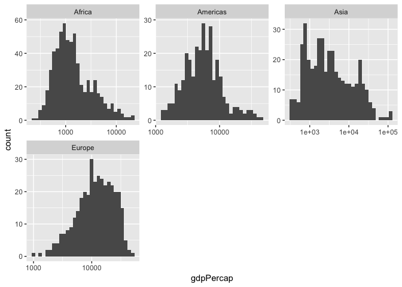
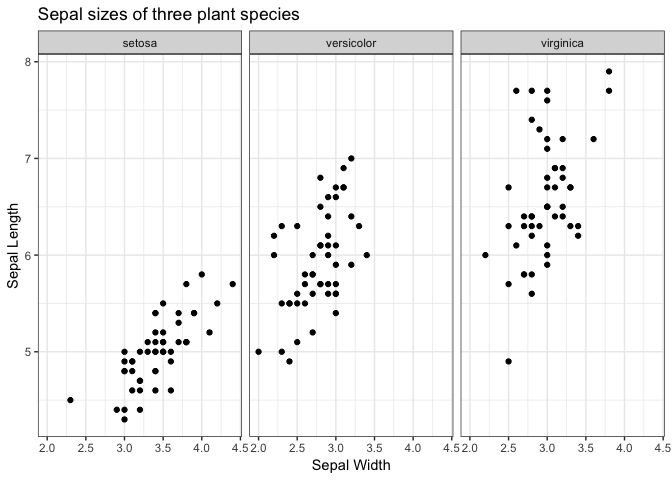
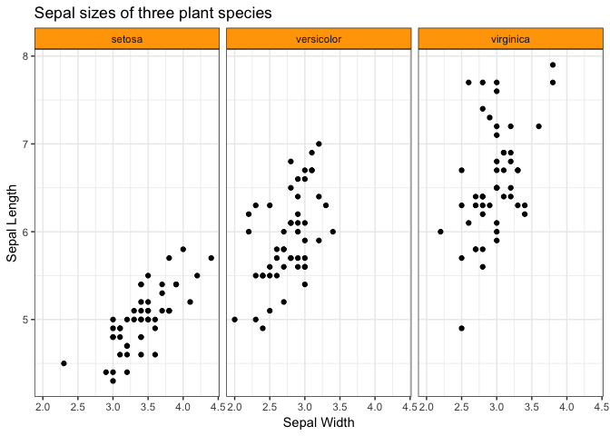
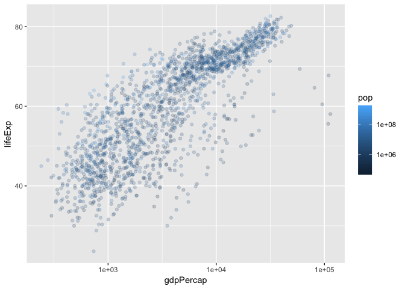
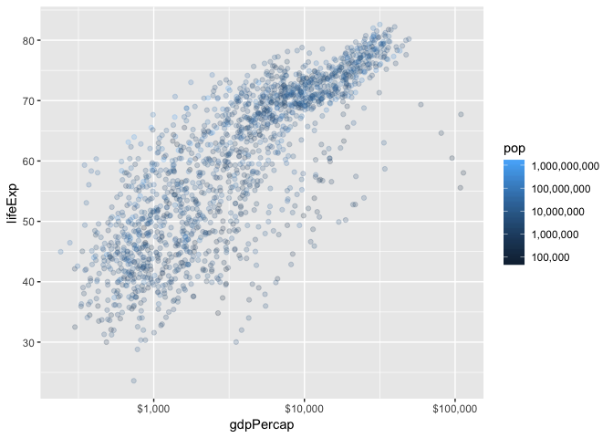
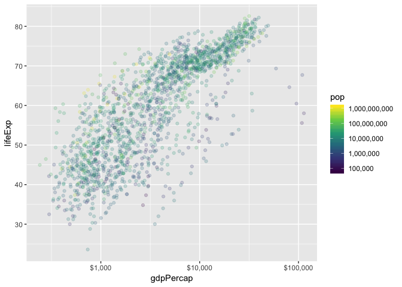

Lecture 3 Worksheet
================

``` r
library(tidyverse)
```

    ## ── Attaching packages ───────────────────────────────────────────────────────────────────────────────────── tidyverse 1.2.1 ──

    ## ✔ ggplot2 3.0.0     ✔ purrr   0.2.5
    ## ✔ tibble  1.4.2     ✔ dplyr   0.7.6
    ## ✔ tidyr   0.8.1     ✔ stringr 1.3.1
    ## ✔ readr   1.1.1     ✔ forcats 0.3.0

    ## ── Conflicts ──────────────────────────────────────────────────────────────────────────────────────── tidyverse_conflicts() ──
    ## ✖ dplyr::filter() masks stats::filter()
    ## ✖ dplyr::lag()    masks stats::lag()

``` r
library(gapminder)
library(RColorBrewer)
library(scales)
```

    ## 
    ## Attaching package: 'scales'

    ## The following object is masked from 'package:purrr':
    ## 
    ##     discard

    ## The following object is masked from 'package:readr':
    ## 
    ##     col_factor

Facetting
---------

Make histograms of `gdpPercap` for each (non-Oceania) continent by adding a line to the following code.

-   Try facetting by `qualLifeExp`.
-   Try the `scales` and `ncol` arguments of the facet layer.

``` r
gapminder %>% 
    filter(continent != "Oceania") %>% 
    mutate(qualLifeExp = if_else(lifeExp > 60, "high", "low")) %>% 
    ggplot(aes(x=gdpPercap)) +
    geom_histogram() +
    scale_x_log10() +
    facet_wrap(~ continent, scales = "free", ncol = 3)
```

    ## `stat_bin()` using `bins = 30`. Pick better value with `binwidth`.



| Grammar Component     | Specification                    |
|-----------------------|----------------------------------|
| **data**              | `gapminder`                      |
| statistical transform | histogram (binning and counting) |
| **aesthetic mapping** | x=gdpPercap; y=count             |
| **geometric object**  | histogram                        |
| scale                 | x is log10; y is linear.         |
| coordinate system     | Rectangular/Cartesian            |
| facetting             | continent                        |

Theming
=======

**Question**: What makes a plot "publication quality"?

Changing the look of a graphic can be achieved through the `theme()` layer.

There are ["complete themes"](http://ggplot2.tidyverse.org/reference/ggtheme.html) that come with `ggplot2`, my favourite being `theme_bw` (I've grown tired of the default gray background, so `theme_bw` is refreshing).

1.  Change the theme of the following plot to `theme_bw()`:

``` r
ggplot(iris, aes(Sepal.Width, Sepal.Length)) +
     facet_wrap(~ Species) +
     geom_point() +
     labs(x = "Sepal Width",
          y = "Sepal Length",
          title = "Sepal sizes of three plant species") +
    theme_bw()
```



1.  Then, change font size of axis labels, and the strip background colour. Others?

``` r
ggplot(iris, aes(Sepal.Width, Sepal.Length)) +
     facet_wrap(~ Species) +
     geom_point() +
     labs(x = "Sepal Width",
          y = "Sepal Length",
          title = "Sepal sizes of three plant species") +
    theme_bw() +
    theme(strip.background = element_rect(fill="orange"))
```



Scales; Colour
==============

Scale functions in `ggplot2` take the form `scale_[aesthetic]_[mapping]()`.

Let's first focus on the following plot:

``` r
p_scales <- ggplot(gapminder, aes(gdpPercap, lifeExp)) +
     geom_point(aes(colour=pop), alpha=0.2)
p_scales + 
    scale_x_log10() +
    scale_colour_continuous(trans="log10")
```



1.  Change the y-axis tick mark spacing to 10; change the colour spacing to include all powers of 10.

``` r
# p_scales +
#     scale_x_log10() +
#     scale_colour_continuous(
#         trans  = "log10", 
#         breaks = FILL_IN_BREAKS
#     ) +
#     FILL_IN_SCALE_FUNCTION(breaks=FILL_IN_BREAKS)
```

1.  Specify `scales::*_format` in the `labels` argument of a scale function to do the following:
    -   Change the x-axis labels to dollar format (use `scales::dollar_format()`)
    -   Change the colour labels to comma format (use `scales::comma_format()`)

``` r
p_scales +
    scale_x_log10(labels=dollar_format()) +
    scale_colour_continuous(
        trans  = "log10", 
        breaks = 10^(1:10),
        labels = comma_format()
    ) +
    scale_y_continuous(breaks=10*(1:10))
```



1.  Use `RColorBrewer` to change the colour scheme.
    -   Notice the three different types of scales: sequential, diverging, and continuous.

``` r
## All palettes the come with RColorBrewer:
# RColorBrewer::display.brewer.all()
# p_scales +
#     scale_x_log10(labels=dollar_format()) +
#     FILL_IN_WITH_RCOLORBREWER(
#         trans   = "log10",
#         breaks  = 10^(1:10),
#         labels  = comma_format(),
#         palette = FILL_THIS_IN
#     ) +
#     scale_y_continuous(breaks=10*(1:10))
```

1.  Run the following code to check out the `viridis` scale for a colour-blind friendly scheme.
    -   Hint: add `scale_colour_viridis_c` (`c` stands for continuous; `d` discrete).
    -   You can choose a palette with `option`.

``` r
p_scales +
    scale_x_log10(labels=dollar_format()) +
    scale_colour_viridis_c(
        trans   = "log10",
        breaks  = 10^(1:10),
        labels  = comma_format()
    ) +
    scale_y_continuous(breaks=10*(1:10))
```


