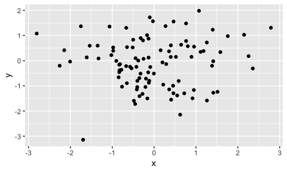
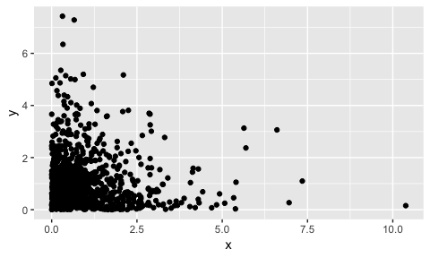
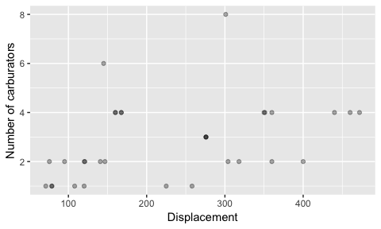
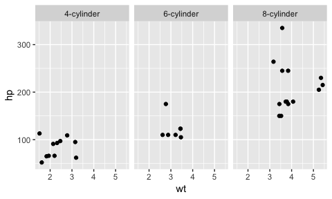
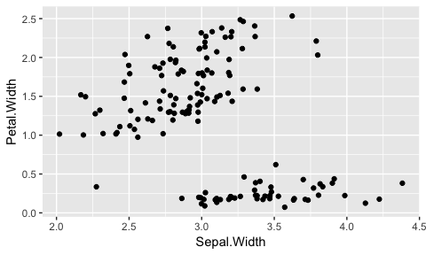
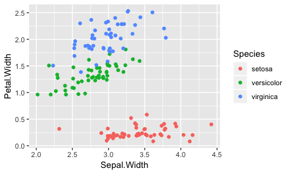
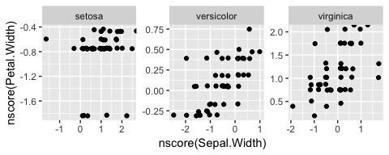

```r
suppressPackageStartupMessages(library(tidyverse))
library(gapminder)
knitr::opts_chunk$set(fig.width=5, fig.height=3)
```

From this lecture, students are expected to be able to:

- Describe the scatterplot of an independent bivariate Gaussian/Normal distribution.
- Describe whether there's dependence, given a normal scores plot of the data.


## Question

What is data science?


## Dependence

Concepts:

- Dependence is the absence of independence, and is more than just linear association.
- When asking for an "amount of dependence", indicators measure how tightly the points adhere to a curve.
- You can't add/remove dependence through monotone transformations. 
- Dependence is more than just linear association.
- Dependence helps us get information of one variable if we know something about the other. 
- Normal scores plots are useful for viewing dependence unobscured by the marginals. 

### Independence demo

Gaussian demo: what does independent bivariate Guassian look like? Let's try different mean and sd's. 


```r
n <- 100
x <- rnorm(n)
y <- rnorm(n)
qplot(x, y)
```

<!-- -->

Generic independence:

1. Give me a marginal distribution for x, and one for y. 
2. View a scatterplot.
3. Try monotone transformations on x or y to try to make dependence.


```r
n <- 100
# x <- 
# y <- 
qplot(x, y)
```

<!-- -->

Practicalities of independence: x and y do not inform each other.

### Dependence demo

How do you answer the question "how _much_ dependence is there?"

Demo:

1. Give me a way in which x and y can depend on each other. 
2. View a scatterplot.
3. Try monotone transformations on x or y. Does the "amount" of dependence change?


```r
n <- 
# x <- 
# y <- 
qplot(x, y)
```

Practicalities of dependence: each variable informs the other. Useful if we know something about one, and want to know something about the other (this is a HUGE part of data science!)

### Normal Scores Plots

Normal scores plots are a useful way to standardize the viewing of dependence (amongst two variables).

1. Transform margins to N(0,1):
    1. First transform to uniform scores, by dividing the rank by `n`.
    2. Then, apply `qnorm()`. 
2. Make the scatterplot of the transformed variables.

Function for Step 1:


```r
nscore <- function(x) qnorm(ecdf(x)(x))
```

Convert the following scatterplot to a normal scores plot. Is there dependence?


```r
n <- 1000
x <- rexp(n)
y <- rexp(n)
qplot(x, y)
```

<!-- -->

Try making a normal scores plot of previous examples OR data examples:


## Return to EDA

EDA is not about fishing for meaning. Ask yourself this question: _what does this graph show that we can't see from viewing the raw data set_? 

Examples:


```r
ggplot(mtcars, aes(disp, carb)) + 
    geom_point(alpha=1/3) +
    labs(x = "Displacement",
         y = "Number of carburators")
```

<!-- -->

Nothing going on in the above plot. End of story.


```r
mtcars %>% 
    mutate(cyl = paste0(cyl, "-cylinder")) %>% 
    ggplot(aes(wt, hp)) + 
    geom_point() +
    facet_wrap(~ cyl)
```

<!-- -->

Nothing going on within each panel above. Though, more cylinders tend to have higher hp.


```r
ggplot(iris, aes(Sepal.Width, Petal.Width)) +
    geom_jitter()
```

<!-- -->

Data fall into at least two groups. Explore further:


```r
ggplot(iris, aes(Sepal.Width, Petal.Width)) +
    geom_jitter(aes(colour=Species))
```

<!-- -->

Data fall into three groups! Is there dependence within each group? Check against normal scores plot:


```r
ggplot(iris, aes(nscore(Sepal.Width), nscore(Petal.Width))) +
    geom_jitter() +
    facet_wrap(~ Species, scales="free") 
```

<!-- -->

Not much. Maybe some positive dependence in versicolor. 

## Worksheet

Let's fill out the worksheet on the remaining `ggplot2` tooling.
