> Making effective plots can tell you a LOT about data. Its hard! Its an under-rated but very powerful skill to develop.

\- Di Cook


```r
suppressPackageStartupMessages(library(tidyverse))
library(gapminder)
knitr::opts_chunk$set(fig.width=5, fig.height=3)
```


# Agenda

Tips for effective graphing

At least two exercises related to content and http://viz.wtf/ (see the worksheet).

# Resources

These resources are listed on the syllabus in the lecture table. They provide a good overview of tips for effective plotting.

- [Geckoboard's data vis tips](https://www.geckoboard.com/learn/data-literacy/data-visualization-tips/)
- Jenny's STAT545 lecture notes: [do's and don'ts](http://stat545.com/block015_graph-dos-donts.html)

Here are some resources that dive a little deeper:

- Di Cook's [Rookie Mistakes](http://www.dicook.org/2018/04/14/content/post/2018-04-14-rookie-mistakes/).
    - Especially focusses on categorical data.
- Richard Hollins' [Three reasons why pie charts suck](https://www.richardhollins.com/blog/why-pie-charts-suck/)

An entertaining but inspiring resource:

- Gallery of poor data vis: <http://viz.wtf/>

If you want to spend more time on this and/or dig deeper, take a look at the following books:

- [Visualization Analysis and Design](http://webcat1.library.ubc.ca/vwebv/holdingsInfo?bibId=7678980) -- Tamara Munzner
- [Creating more effective graphs](http://resolve.library.ubc.ca/cgi-bin/catsearch?bid=3198934) -- Naomi Robbins.


# Preface

- Effectiveness: how well a graph conveys the information conveyed in data.
- != publication quality, although sometimes the line between these two can be blurry (no pun intended).
- Take solace in the fact that we can't make perfectly effective graphics. 
- Is a topic in human psychology. 
- Don't know human psychology? Luckily, you're a human, and have an innate knowledge of the relative effectiveness of a plot. Use that as your guide! 
    - From Gelman et al, As a guiding point, ask yourself: how can I modify my graph to better:
        1. faciliate comparisons, and
        2. reveal trends?

__Disclaimer__: The tips you see here and online hold true for most cases. There might be _some_ rare cases where the tips don't hold -- the key is to be _intentional_ about every component of the graph. 

"Let's Practice What We Preach: Turning Tables into Graphs" by Gelman A, Pasarica C, Dodhia R. The American Statistician, Volume 56, Number 2, 1 May 2002 , pp. 121-130(10).

# Learning Objectives

From today's lecture, students are expected to:

- be intentional with your choice of graph components.
- be able to spot bad graphs, and avoid making them.
- internalize some tips of plotting effectiveness provided in class.

For the quiz, you aren't expected to know/memorize all of the tips.

# Consider Information Density

Sometimes called overplotting.

- Scatterplot too dense?
    - Do you need a log transform?
    - Try alpha transparency
    - Change geom: `geom_hex()` or `geom_bin2d()`
    - Spread the data into separate panels: facet by a grouping variable or two.


```r
gapxy <- ggplot(gapminder, aes(lifeExp, gdpPercap)) +
    theme_bw()
gapxy + geom_point()
```

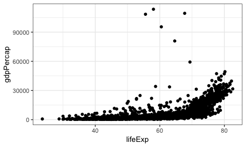<!-- -->

```r
gapxy <- gapxy + scale_y_log10()
gapxy + geom_point() 
```

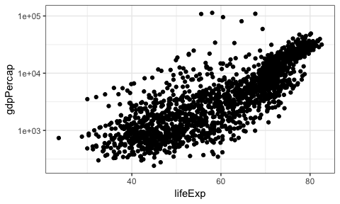<!-- -->

```r
gapxy + geom_point(alpha=0.2)
```

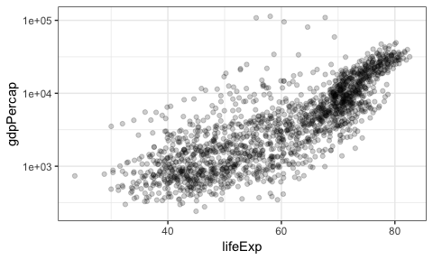<!-- -->

```r
gapxy + geom_hex() 
```

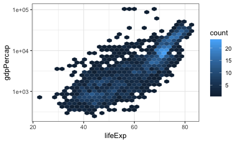<!-- -->

```r
gapxy + geom_density2d()
```

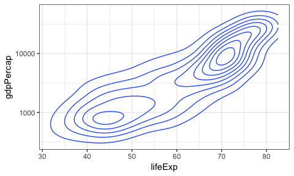<!-- -->

```r
gapxy + facet_wrap(~continent) + geom_point(alpha=0.2) 
```

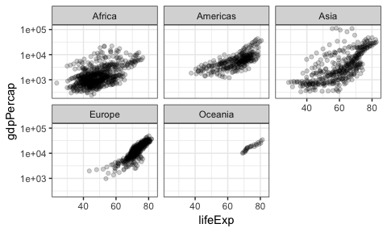<!-- -->

- Using too many geom's? Don't.


```r
ggplot(gapminder, aes(continent, lifeExp)) +
    geom_violin(fill="red", alpha=0.2) +
    geom_boxplot(fill="blue", alpha=0.2) +
    geom_jitter(alpha=0.2)
```

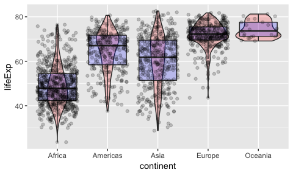<!-- -->

# Find the [Goldilocks](https://www.dltk-teach.com/rhymes/goldilocks_story.htm) Plot

Display just the right amount of content: not too much, not too little.

In particular: reveal as much relevant information as possible; trim irrelevant and redundant information.

## Reveal as much relevant information as possible

Because hiding your data is not effective at conveying information!

- jitter + violin, not pinhead plots.
- mosaic plots

## Trim Irrelevant Information

Only use as much data as is required for answering a data analytic question.

- Di Cook's example in [Rookie Mistakes: reduce complexity section](http://www.dicook.org/2018/04/14/content/post/2018-04-14-rookie-mistakes/#reduce-complexity).

- Remove the special effects (sorry, Excel). Great demo: Darkhorse analytic's [Less is more](https://github.com/STAT545-UBC/STAT545-UBC.github.io/blob/master/img/less-is-more-darkhorse-analytics.gif) gif.

- More examples of extraneous information:


```r
map_data("france") %>% 
    ggplot(aes(long, lat)) +
    geom_polygon(aes(group=group), fill=NA, colour="black") +
    theme_bw() +
    ggtitle("Are lat and long really needed?")
```

```
## 
## Attaching package: 'maps'
```

```
## The following object is masked from 'package:purrr':
## 
##     map
```

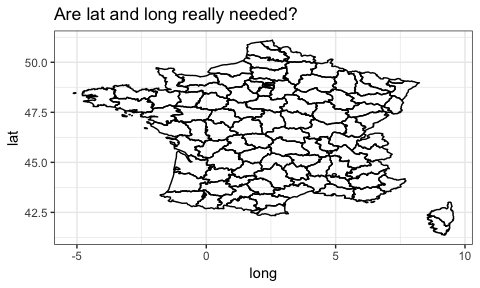<!-- -->

```r
ggplot(gapminder, aes(year, lifeExp)) +
    geom_line(aes(group=country, colour=country), alpha=0.2) +
    guides(colour=FALSE) +
    theme_bw() +
    ggtitle("Is colouring by country really necessary here?\nNevermind fitting the legend!")
```

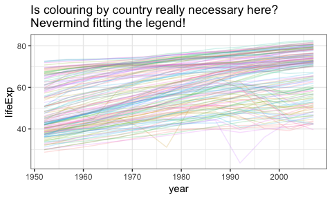<!-- -->

## Trim Redundant Information

Don't redundantly map variables to aesthetics/facets. 

- Common example: colouring/filling and facetting by the same variable.


```r
HairEyeColor %>% 
    as_tibble() %>% 
    uncount(n) %>% 
    ggplot(aes(Hair)) +
    facet_wrap(~Sex) +
    geom_bar(aes(fill=Sex)) +
    theme_bw() +
    ggtitle("Don't do this.")
```

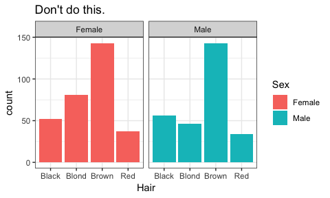<!-- -->

Really want to use colour? No problem, colours are fun! Try this:


```r
HairEyeColor %>% 
    as_tibble() %>% 
    uncount(n) %>% 
    ggplot(aes(Hair)) +
    facet_wrap(~Sex) +
    geom_bar(fill="#D95F02") +
    theme_bw() +
    ggtitle("Do this.")
```

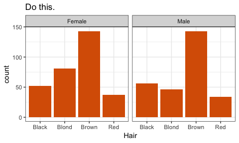<!-- -->

- Delegate numeric details to an appendix, not the graph (or omit entirely). 


```r
HairEyeColor %>% 
    as_tibble() %>% 
    uncount(n) %>% 
    count(Hair) %>% 
    ggplot(aes(Hair, n)) +
    geom_col() +
    geom_text(aes(label=n), vjust=-0.1) +
    theme_bw() +
    labs(x="Hair colour", y="count", 
         title="Are the bar numbers AND y-axis really needed?")
```

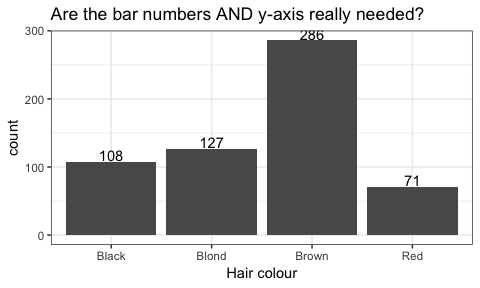<!-- -->

# Choose Human-Interpretable Aesthetic Mappings and Geom's

- Here's an iconic fail in [Henrik Lindberg's tweet](https://twitter.com/hnrklndbrg/status/886181647003119616?lang=en): the "depeche plot".

- Don't use pie charts -- use bar charts instead. [3 reasons why they suck.](https://www.richardhollins.com/blog/why-pie-charts-suck/)

- To bar, or not to bar? Not if zero doesn't matter! As a general rule, I like to err on the side of points over bars. 


```r
plot_beav2 <- bind_rows(
    mutate(beaver1, beaver = "Beaver 1"), 
    mutate(beaver2, beaver = "Beaver 2")
) %>% 
    group_by(beaver) %>% 
    summarize(med = median(temp)) %>% 
    ggplot(aes(beaver, med)) +
    theme_bw() +
    xlab("") +
    ylab("Body Temperature\n(Celsius)")
cowplot::plot_grid(
    plot_beav2 +
        geom_col() +
        ggtitle("Don't do this."),
    plot_beav2 +
        geom_point() +
        ggtitle("Do this.")
)
```

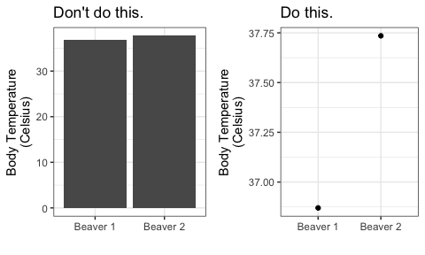<!-- -->

(Yes, that's really all the info you're conveying. Own it.)

- Colour your groups so that not one group unintentionally stands out.


```r
plot_iris <- ggplot(iris, aes(Sepal.Width, Sepal.Length)) +
    geom_jitter(aes(colour=Species)) +
    theme_bw() +
    theme(legend.position = "bottom")
cowplot::plot_grid(
    plot_iris +
        scale_colour_manual(values=c("brown", "gray", "yellow")) +
        ggtitle("Don't do this."),
    plot_iris +
        scale_colour_brewer(palette="Dark2") +
        ggtitle("Leave it to an expert.\nDo this.")
)
```

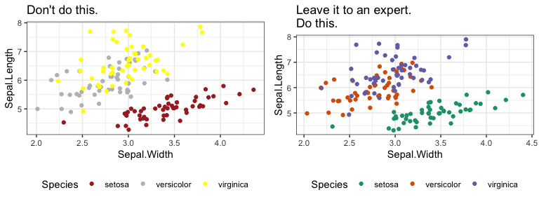<!-- -->


# Consider Zero

Are you comparing data across groups? Consider what a meaningful _distance measure_ might be between two groups.

Are _differences_ meaningful, and _proportions_ not? Example: temperature. Zero doesn't matter.


```r
plot_beav <- bind_rows(
    mutate(beaver1, beaver = "Beaver 1"), 
    mutate(beaver2, beaver = "Beaver 2")
) %>% 
    ggplot(aes(beaver, temp)) +
    geom_violin() +
    geom_jitter(alpha=0.25) +
    theme_bw() +
    xlab("") +
    ylab("Body Temperature\n(Celsius)")
cowplot::plot_grid(
    plot_beav + 
        ggtitle("This."), 
    plot_beav + 
        ylim(c(0,NA)) +
        ggtitle("Not This.")
)
```

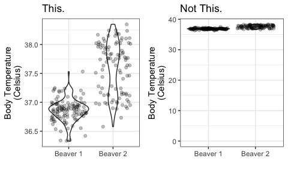<!-- -->

Are _proportions_ meaningful, and _differences_ not? Example: counts.


```r
HairEyeColor %>% 
    as_tibble() %>% 
    uncount(n) %>% 
    ggplot(aes(Hair)) +
    geom_bar() +
    theme_bw() +
    ggtitle("Keep this starting from 0.")
```

<!-- -->

Want to convey absolute life expectancies, in addition to relative life expectancies? Show 0.


```r
ggplot(gapminder, aes(continent, lifeExp)) +
    geom_boxplot() +
    ylim(c(0, NA)) +
    geom_hline(yintercept = 0,
               linetype = "dashed")
```

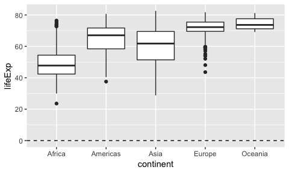<!-- -->

# Order factors

It's easier to see rankings. [See this STAT 545 example by Jenny Bryan](http://stat545.com/block029_factors.html#change-order-of-the-levels-principled). Use `forcats`!

